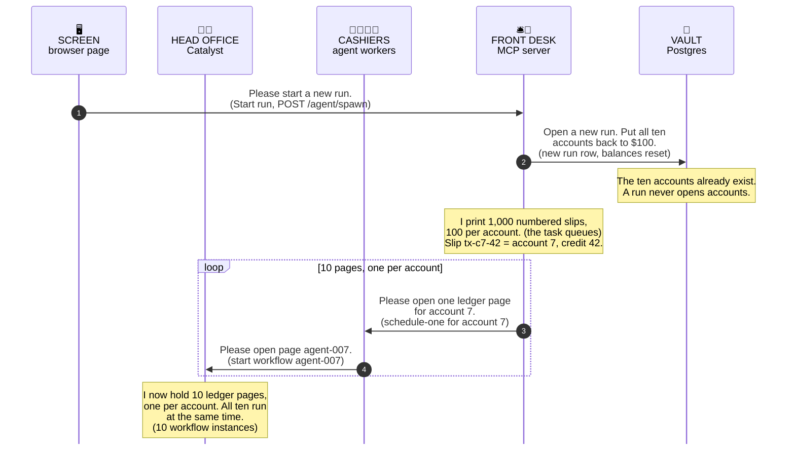
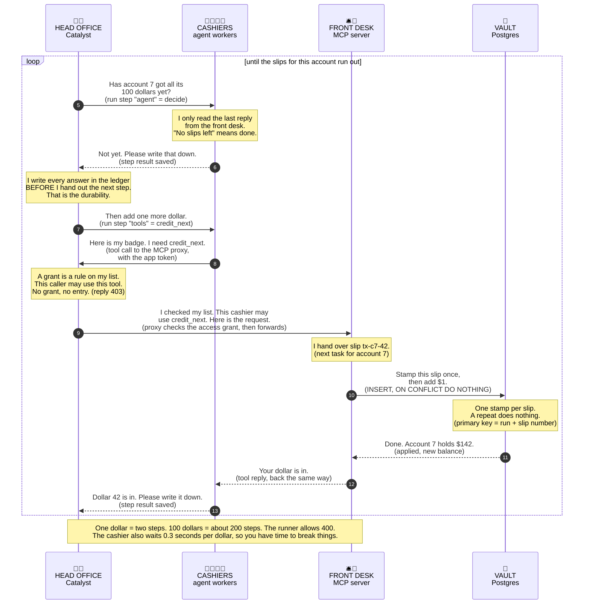
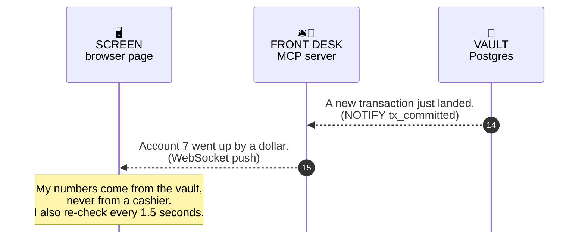
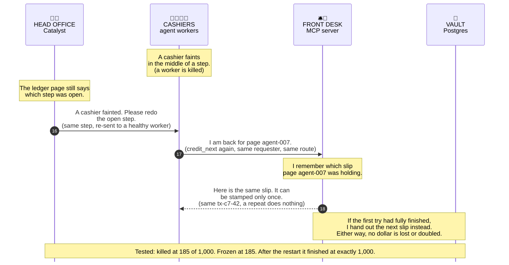

# Bank Creditor Demo - App Flow (80/20)

> The 20% of the app flow that explains 80% of the demo, drawn as four small sequence diagrams, one per step.
> New base doc for this repo. The cashier-and-ledger picture is reused from `HOW_TO_RUN.md`, so the two docs stack.
> Sources: the repo code at commit `4f6c6c3` (source unchanged in `f010d98`) and my sandbox run of it. Reviewed 2026-09-19.

---

## What it is (one line)
Ten durable workflows each credit one bank account from $100 to $200, one dollar at a time, while you kill things. Every account still ends at exactly $200, with exactly 1,000 transactions.

Picture a bank branch that is run by hand. That one picture carries this whole doc.

---

## The mental model - "One screen, one head office with ten ledger pages, a few cashiers, one front desk, one vault, one stamp per slip"

- **One screen** is the **browser page**. It sends Start, Stop and Reset. It shows the balances live.
- **One head office with ten ledger pages** is **Diagrid Catalyst**. It keeps one ledger page per account. A ledger page is one Dapr (Distributed Application Runtime) Workflow instance with its saved history. Head office also guards the door to the front desk.
- **A few cashiers** are the **agent worker processes**. There is one on a laptop. There are two pods by chart default. A cashier keeps nothing in his head. He does the one step that head office hands him.
- **One front desk** is the **MCP (Model Context Protocol) server**. It prints the numbered deposit slips. It sends the cashiers to work. It owns the one tool, `credit_next`.
- **One vault** is **Postgres**. It holds the accounts and the transactions.
- **One stamp per slip** is the **idempotency key**. Each slip number can be stamped into the vault's book once. A second try with the same slip does nothing.

Recall hook: it extends the `HOW_TO_RUN.md` picture. There, a durable agent was "a cashier who writes every dollar in a ledger". Here you see who keeps the ledger, and who stamps the slip.

---

## Sequence diagram - the request flow in 4 steps

Read each arrow as what one person says to the next. The technical name follows in brackets. The yellow notes hold the facts you need at that spot. The arrow numbers run from 1 to 18 across the four diagrams.

Diagram mnemonic: **S-H-C-F-V** = "See Happy Cashiers Fill Vaults."
🖥️ Screen, 🏢📒 Head office, 🧑‍💼🧑‍💼 Cashiers, 🛎️🧾 Front desk, 🔐 Vault. That is the order of the lifelines, left to right. A step leaves out the lifelines it does not need.

### Step 1. Start the run (arrows 1 to 4)

You now know: a run is ten ledger pages and 1,000 numbered slips.

### Step 2. Credit one dollar (arrows 5 to 13)

You now know: every dollar is two ledger lines, and each line is written before the next step starts.

### Step 3. Show it (arrows 14 and 15)

You now know: the balances on the screen come from the vault, never from a cashier.

### Step 4. A cashier faints (arrows 16 to 18)

You now know: a step can run more than once, and the stamp makes the repeat harmless.

---

## The vital 20% vs the trivial-many 80%

**The 20% to know.** Recall hook: **"STAMP"**.
- **S - Steps are saved.** Head office writes every step result before it hands out the next step. This is the whole durability story.
- **T - Two steps per dollar.** `agent` decides and `tools` credits. The decision is a fixed function today. It uses no LLM (large language model).
- **A - Account owns a page.** There is one workflow instance per account. A kill freezes that account on the screen, and it resumes from the same dollar.
- **M - MCP door.** Every tool call passes the Catalyst proxy at `/v1.0/diagrid/mcp/bank-postgres-mcp`. A `403` reply almost always means a missing grant.
- **P - Primary key is the stamp.** The key is `(execution_run_id, tx_id)` with `ON CONFLICT DO NOTHING`. Steps run at least once. The stamp absorbs the repeats. Together that is exactly once.

**The 80% that is breadth (reference by name):**
- Chaos controls: `/chaos/drop`, `/chaos/latency`, `/chaos/pod-kill`, `/chaos/az-kill`, the pod list and the heatmap slot tracker.
- Front desk housekeeping: the 60-second sweep of stale slips, ghost reconciliation, the Stop flag, `SCHEDULE_THROTTLE_MS`.
- Agent details: `max_steps=400`, the fixed-size `BankerState`, the `/trigger`, `/status`, terminate and purge endpoints, the `agent-plain` and `agent-dapr-agents` variants.
- Kubernetes packaging: the Helm charts, zone spread, `hostAliases`, the trailing-slash shim and the allowed-hosts list.
- Extra data: the `audit_log` table and the read-only tools `list_customers` and `get_customer`.

---

## Why this matters when you present the demo

| The durable engine gives you | Without it, you build |
|---|---|
| **S**aved steps: each result is kept before the next step | Your own checkpoint table and resume logic |
| **A**ccess grants: per caller and per tool, at the proxy | An auth layer in front of every tool server |
| **F**ailover: a dead worker's step goes to a healthy worker | Heartbeats, leases and takeover logic |
| **E**vidence: every run and every step is on record | Custom audit logging |
| **R**etries: a failed step runs again | Retry loops with backoff in every caller |

Recall hook for the table: durable execution makes agents **"SAFER"**.

You still own one thing: the stamp. The engine repeats steps. Your write must tolerate the repeat.

One-line takeaway for a room: "Head office keeps the ledger and re-sends the step. The vault stamps each slip once. So a cashier can faint, and every account still lands on exactly $200."

---

## Scope and caveats
- Built from the code, and from a run in a Linux sandbox on plain local Dapr. I have not watched Catalyst itself re-send a step. That part rests on `CLAUDE.md` and the Diagrid docs.
- The diagram shows the Catalyst route. On the no-account laptop path (`HOW_TO_RUN.md` Part 3), head office is a local Dapr sidecar with Redis, and the patch lets the cashier call the front desk directly.
- The slip list lives in the front desk's memory. From reading the code, a front desk restart reprints all slips for the current run, and the stamp turns the used ones into no-ops. I have not tested that.
- The large icons on the lifelines come from a style line inside each diagram. A viewer that ignores that line shows the same icons in small size.

---

## References (used to build the diagram and this overview)

1. `services/mcp/mcp_server/server.py` - the `credit_next` tool, `/agent/spawn`, the WebSocket push.
2. `services/mcp/mcp_server/replenisher.py` and `orchestrator.py` - run start, page names, slip numbers, replay of an in-flight slip.
3. `services/mcp/mcp_server/db.py` and `local/init.sql` - the insert with `ON CONFLICT DO NOTHING`, the primary key, the `tx_committed` notify trigger.
4. `services/agent-langgraph/agent_worker/agent.py`, `main.py`, `mcp_client.py`, `stub_llm.py` - the two-step graph, `max_steps=400`, the 0.3 second pace, `/schedule-one`, the proxy address.
5. `ui-prototype/src/telemetry.jsx` - Start run, the 1.5 second poll, the WebSocket handler.
6. `CLAUDE.md` and `docs/DEMO_FLOW.md` - one instance per account, re-dispatch after a pod kill, the grant and `403` note.
7. Internal companion doc: `HOW_TO_RUN.md` - the cashier-and-ledger picture and the kill test numbers (Appendix A).
8. [Diagrid docs: MCP overview](https://docs.diagrid.io/develop/mcp/) - the proxy address shape and per-tool access policies.
9. [Diagrid quickstart: LangGraph agent](https://github.com/diagridio/catalyst-quickstarts/tree/main/agents/langgraph) - each graph node runs as one durable activity, and a run resumes after a crash.

Code reviewed 2026-09-19. Web sources reviewed 2026-09-18.
