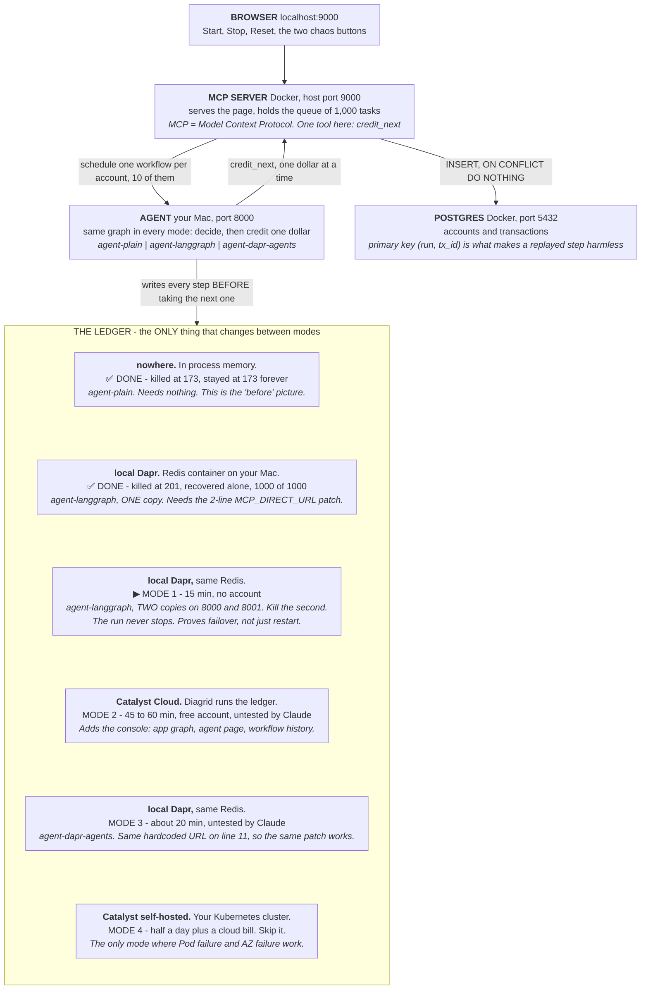

# The modes you can run this demo in

> Written 2026-09-20, after Path A was proven end to end on an Intel Mac.
> Companion to `HOW_TO_RUN.md` (the plan) and `RUN_LOG.md` (what actually happened).

---

## The one idea

Two things vary. Which agent you run, and where its ledger lives. Everything else
in the system is identical in every mode.

The ledger is the workflow history: what step each account was on, written down
before the next step is taken. A cashier who writes every dollar in a ledger can
be replaced mid-shift. A cashier who counts in his head cannot.

---

## System diagram

---

## Ranked by value for your time

| Mode | What it proves that the others do not | Your time | Money | Account |
|---|---|---|---|---|
| **1. Two copies, failover** | It survives **without** a restart. A second copy takes over the dead one's accounts. | 15 min | $0 | none |
| **2. Catalyst Cloud** | The console: app graph, agent page, workflow history. This is the product. | 45-60 min | $0 free tier | Diagrid |
| **3. Dapr Agents variant** | The same durability on a second framework, not just LangGraph. | ~20 min | $0 | none |
| **4. Kubernetes self-hosted** | The Pod failure and AZ failure buttons actually work. | half a day | cloud bill | Diagrid org |

Mode 1 is the one worth doing next. Last night proved "it survives a restart".
Mode 1 proves "it survives without one", which is the claim that matters in
production. Different claim, 15 minutes, nothing to install.

Mode 4 buys two buttons whose message is already proved. The Helm chart defaults
point at the repo authors' own running environment, so asking for access costs
one message instead of half a day.

## Not a mode

Real-LLM. It is documented in `docs/CATALYST.md`, `docs/DEMO_FLOW.md` and
`scripts/switch-llm-mode.sh`, but all three agent variants raise an error when
`STUB_LLM=false`. Appendix B of `HOW_TO_RUN.md` has the detail.

## References

1. `HOW_TO_RUN.md` - Part 3.6 is Mode 1, Part 4 is Mode 2, Part 6 is Mode 4.
2. `services/agent-dapr-agents/agent_worker/mcp_client.py` line 11 - the hardcoded
   Catalyst URL that Mode 3 needs patched, identical to the agent-langgraph one.
3. `RUN_LOG.md` - the two DONE boxes in the diagram, with real numbers.
