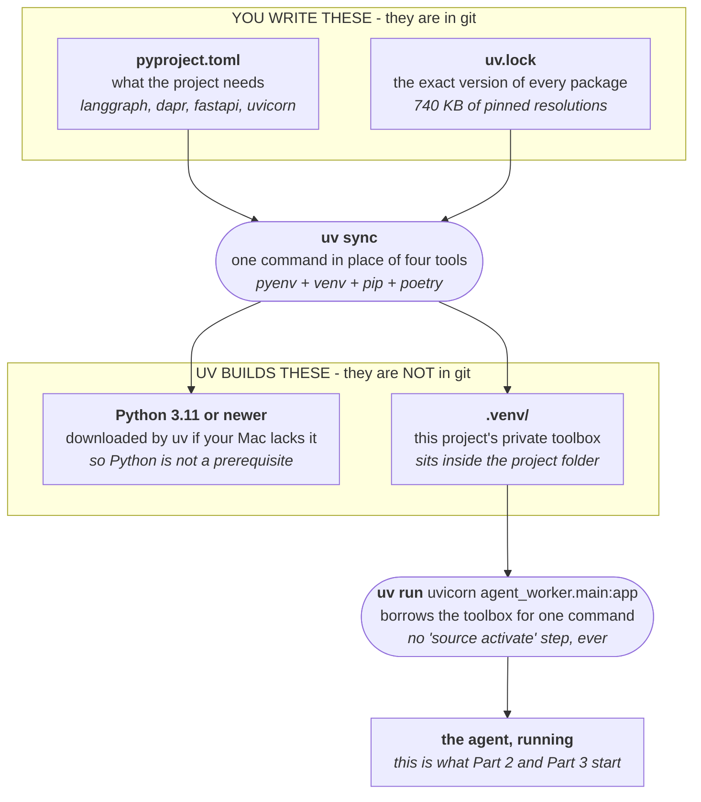

# What is uv

> A short note, written 2026-09-19 while setting up this demo.
> uv is the Python package and project manager this repo uses in place of pip.
> Sources at the bottom.

---

## One line

uv is a single tool that installs your Python packages, builds the isolated
environment they live in, and downloads Python itself if you need it. It is
written in Rust and ships as one binary. It comes from Astral, the people who
make the Ruff linter.

## The analogy: a private toolbox per project

Every Python project needs its own set of libraries, at its own versions. Two
projects on the same Mac will want different ones. So each project gets its own
toolbox, kept in a `.venv` folder inside the project.

Before uv you assembled that toolbox from four separate tools. uv is all four in
one command, and it is roughly 10 to 100 times faster than pip.

---

## How it works here



You now know why `HOW_TO_RUN.md` never says "create a virtualenv" and never says
`pip install`. Those two commands cover it.

---

## The two commands, and what each one replaces

| Command | What it does | What it replaces |
|---|---|---|
| `uv sync` | Reads `pyproject.toml` and `uv.lock`. Builds `.venv` with exactly those versions. Fetches a Python if needed. | `pyenv install`, `python -m venv`, `pip install -r`, `poetry install` |
| `uv run CMD` | Runs `CMD` inside that `.venv`, for that one command only. | `source .venv/bin/activate` then the command |
| `uv self update` | Upgrades uv itself. | `brew upgrade uv` |

---

## Why the Homebrew install was so slow on this Mac

uv is a compiled Rust binary with no Python underneath it. Astral publishes a
ready-made one for Intel Macs, which is the five-second download that worked.

Homebrew no longer ships prebuilt binaries for Intel Macs. So it planned to
compile that binary here, from Rust source, using a compiler it would also
compile first:

```
llvm@22  ->  rust  ->  uv
 hours      ~30-60m    ~10m
```

Three chained source builds to arrive at a file Astral already publishes.
See `RUN_LOG.md` for what actually happened.

---

## References

1. [uv - Astral Docs](https://docs.astral.sh/uv/) - `uv sync`, `uv run`, project layout, managed Python versions.
2. [astral-sh/uv on GitHub](https://github.com/astral-sh/uv) - "An extremely fast Python package and project manager, written in Rust."
3. [uv: Python packaging in Rust - Astral](https://astral.sh/blog/uv) - the original announcement and the speed claims.
4. This repo: `services/agent-langgraph/pyproject.toml` and `services/agent-langgraph/uv.lock`.

Web sources reviewed 2026-09-19.
